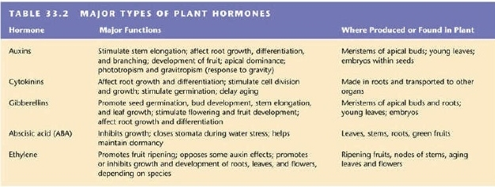

[up](../index.md)

# Bio Lecture March 26th

## Housekeeping

- Exam 3 a week from today
- Project part 3, "Discussion Post", due by 11:59PM this Friday

## Chapter 32

- Uptake and Transport of Nutrients (last class)
- Plant nutrients and the soil (last class)
- Plant nutrition and symbiosis

### Plan nutrition and symbiosis

- Nitrogen fixing bacteria
	- Convert atmospheric bacteria (N2) to ammonia (NH3)
- Ammonifying Bacteria
	- Decompose organic matter, creating more ammonium
- Nitrifying Bacteria
	- Convert ammonium to nitrates, to be absorbed by plant

Root Nodules "activate" when a plant needs nitrogen. Nitrifying bacteria are stored in the nodules.

*Mycorrhizae* is a type of fungi that coats the roots of a plant. Like an extension of root hair, helps absorb things from the soil. Also releases some antibiotics into the soil. interesting.

Orchids don't require much water - 1 to 2 ice cubes will last a week.

Some plants (Venus fly traps) capture and digest small animals (insects)

> Notecard
> - True/False
> - a factor that influences guard cell activity
> - what causes phloem sap to flow from sugar source to sink?

## Next Chapter!

- Plant hormones are found in very small concentrations
- There are roughly 5 types of hormones, all deal with promoting/inhibiting growth.

> This is a terrible image but it's word-for-word from the slides

Tropism - a plant growing towards or away from an organism

- Darwin's Experiment
	- Control plant grew towards light
	- Plant with tip removed went up
	- plant with tip covered by cap went up
	- plant with tip covered by transparent cap grew towards light
	- plant with base covered by opaque shield grew towards light
- Part II
	- Limiting communication between the tip and stem decreased but did not eliminate growth towards light.

Auxins

released from apical meristem, stimulates elongation of roots and stems. Low amounts stimulate roots, higher amounts inhibit roots and stimulate stems, even higher amounts inhibits both roots and stems.

Cytokinins

- Delay Aging
- produced in roots

> Liquid immortality

Gibberellins

- causes elongation, "bolting", going fast
- makes grapes less circular and happy, more narrow and dense - they're trying to *go*.

> It's like caffeine, but for plants.

Abscisic acid (aba)

- wears many hats
- Slows growth down
- high concentrations promote seed dormancy
	- ABA must be removed/deactivated for germination to happen
	- ratio of ABA to Gibberellins controls germination
- conserve energy, survive drought.

> It makes the plants feel tired.

Ethylene

- Gaseous by-product of coal combustion
- natural occurring plant hormone
- found in aging tissues
- ripens fruits
- programed cell death
	- Leaf senescence (change color)
	- Leaf abscission (fall off)
- response to stress (shorter days, injury)

### Response to Stimuli

Tropism - directed growth, towards or away a stimuli

- Gravitropism - it knows which way is down
- Thigmotropism - it knows when something touches it

Plants have circadian rhythms.

- influenced by environmental cues, light.
- controlled by internal time-keeping

![][1]

The above bean plant wants the sunlight at noon, and is taking a break at midnight.

Short day vs Long day plants.

Some plants will flower only when experiencing shorter periods of UV radiation - shorter daytimes.

Long day plants will flower when the days are long enough.

# End

Thursday: Biomes, and how plants deal with herbivores.

[1]: http://www.sliderbase.com/images/referats/1454b/(50).PNG
