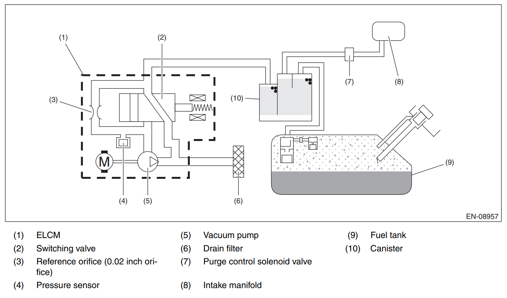

---
---

[Home](../../index.md) > 2014 Imprezza Evap System

# The Evap System

When the pressure in the *Fuel tank* is too low, the evap system lets clean air in. When the pressure is too high, the evap system filters out gas fumes and vents to the atmosphere.

When conditions are right, the Electronic Control Unit (ECU) can purge the filtered fumes to the engine to be burned.

## Quick overview of parts

- Fuel tank
	- Contains gas (and fumes)
- Charcoal canister
	- Filters gas fumes out of air
	- Fume-filed air from the tank is scrubbed here
	- Clean air from the outside picks up fumes here on the way to the engine during purging
- EVAP check valve
	- Allows fumes (and not fuel!) to enter the EVAP vent line
	- Allows fresh air to enter the Fuel tank
- EVAP vent line
	- Connects the Fuel tank and the charcoal canister
- Vapor pressure sensor
	- Measures the difference in pressure between the EVAP system and the atmosphere
- Purge line
	- Connects the Charcoal canister to the engine's *intake manifold*
	- Opened / closed by the *purge control solenoid valve*
- On-board recovery valve / fill check valve / over-fill check valve
	- Vents tank fumes to canister while fueling
	- Does the same thing as the EVAP check valve, just faster
	- When the gas cap is off, the valve can open. Otherwise, it is closed.
- Vacuum switching valve
	- 12 volts cycles the valve

## Diagram

## The Fuel tank

Gas comes in when you fuel the car, and goes out via the fuel pump to the engine.

When gas comes into the tank, the pressure rises. Excess air (carrying fumes) is vented through the *fill check valve* to the charcoal canister, where the fumes are scrubbed out. The clean air exits the EVAP system to the atmosphere.

During operation, any excess air is vented through the *EVAP check valve* to the charcoal canister, is scrubbed, and is vented.

When the gas level in the tank drops, air enters the tank through a series of one-way valves.

## Charcoal Canister

The charcoal canister is full of activated charcoal. It's very good at absorbing fuel vapors. It never wears out, and costs $300 to replace. If your issue isn't a vacuum leak, you probably *don't* have to replace this.

Fuel vapors are absorbed here before air leaves to the atmosphere.

During a purge cycle, vapors trapped here are released into the engine to be burned.

# P1449

The engine intake manifold (8) operates at a negative pressure relative to the atmosphere. During a purge cycle, the purge control solenoid valve (7) and vacuum switching valves (2) open. Clean air enters the drain filter (6), passes through the switching valve (2), picks up fuel fumes in the charcoal canister (10), passes through the purge control solenoid valve (7), and enters the engine intake manifold (8).

During the purge cycle, the ELCM pressure sensor (4) measures the air pressure. A small drop in pressure is expected. If the drop in pressure is too large, then:

- The engine intake manifold is successfully drawing air from the system
	- The purge control solenoid valve is opening correctly
	- The charcoal container is not clogged
- Outside air is not entering the ELCM. Either:
	- The drain filter (6) is clogged
	- The switching valve (2) is not opening correctly.
- The ECU throws Diagnostic Trouble Code (DTC) `P1449`

## Repair

The *Drain filter* is located on the passenger side, near the rear tire. You will have to get under the car to see it.

> I never found my issue. I took out the drain filter (the only part I could without dropping the rear diff), and it seemed clean. I ran some compressed air through it, put it back, and cleared the code - It's been fine for some 700 miles so far.
