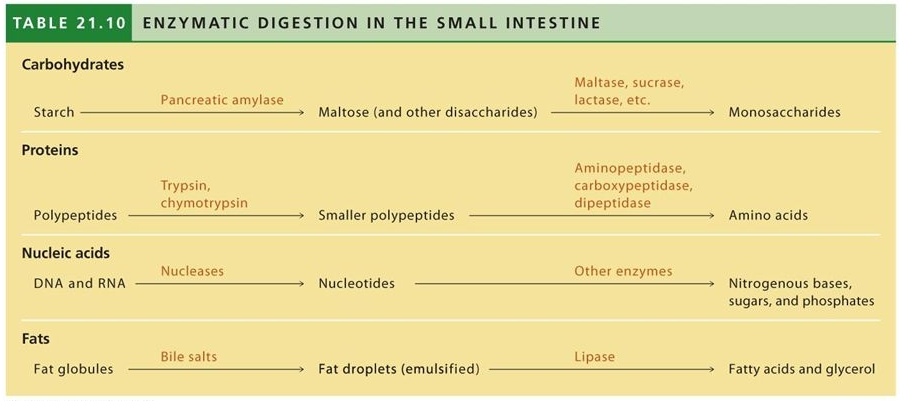

[up](../index.md)

# Bio II Lecture, FEB07

## Housekeeping

- picking up at chap 21
- Homework 3 due FEB10th (sunday) 11:59pm
- Homework 4 and 5 due FEB17 (sunday) 11:59pm
- Exam1 grades by the end of the week
- Exam1 hard copies returned next Tuesday
- Project part II to be assigned next Tuesday

## Chapter 21 - Nutrition and Digestion

- Obtaining and processing of food
- The Human Digestive System
- Nutrition

### Obtaining and Processing Food

- The Basic sequence of events:
    - Ingestion
        - Eat
    - Digestion
        - Break apart
    - Absorption
        - Absorb nutrients
    - Elimination
        - Remove undigested material
- Methods of Digestion
    - Chemical
    - Mechanical
- History
    - Sponges digest in cell vacuoles
    - flatworms and cnidarians have a gastrovascular cavity
        - Incomplete gut system
    - Hydra
        - Tentacles bring food into mouth
        - Enzymes released, break down food
        - Food particle engulfed by cells
        - Cells digest particles in vacuole
    - Then we formed the *alimentary canal*
- Alimentary Canal
    - Mouth, series of special organs, anus
    - food flows through in one direction
    - Canal is longer in organisms that consume plants
        - shorter in carnivores

### The Human Digestive System

- Need To Know:
    - Major organs
    - what those organs do
        - What is being broken down
        - how is it being broken down (mechanical/chemical?)
- Big Words
    - **Peristalsis** - waves of smooth muscle contraction move food along.
    - **Sphincters** - Muscular valves between some organs
- Sequence of Events
    - Mouth Cavity
        - Mechanical
            - Chewing cuts, smashes, grinds
            - Tongue shapes food into a *bolus*
        - Chemical
            - We produce ~1.5 Liters of saliva per day
            - Saliva is 99% H2O, also got:
                - Slippery Glycoprotein for lubrication
                - Buffers to adjust pH
                - Amylase begins breaking down carbohydrates
                - Antibodies
            - We get a little cleaning power here as well.
    - Pharynx
        - Like a train track switch
        - epiglottis flips down, sends food down esophagus
        - Esophageal Sphincter allows food into the esophagus
    - Esophagus
        - Peristalsis moves food along
    - Stomach
        - Mechanical
            - 20 second interval contractions
            - Mix food with enzymes, form *chyme*
        - Chemical
            - Gastric Juices:
            - Mucus - protects stomach from itself
            - pepsin - protein digesting enzyme
            - Strong acid, pH ~2
            - Kills bacteria, Breaks apart cells, denatures proteins
        - pepsinogen, inactive version of pepsin
            - Protects stomach lining
        - New Lining every 3 days
        - Interior surface lined with 'pits'
            - chief cells
                - Hcl - Hydrochloric Acid
            - Parietal cells
                - Secrete pepsinogen
        - As we eat, pH becomes less aggressively acidic
            - This triggers HCl to turn pepsinogen to pepsin
            - Cells emit more pepsinogen and HCl, bring that pH back down.
    - Accessory Structures
        - Liver
            - Converts glucose to glycogen
            - Stores glycogen, releases as needed
            - Modifies toxins into other things
                - Alcohol -> Acetaldehyde -> Acetate
            - Produces *bile*
                - Not an enzyme
                - used for lipid emulsification
            - Gives bile directly to small intestine as needed
            - Gives extra bile to the gall bladder
        - Pancreas
            - > When in doubt, the enzyme came from the pancreas
            - Exocrine System
                - lipases
                - carbohydrate breakdown
                - proteases
                - pH buffer
            - Endocrine System (~1%)
                - Insulin
                - Glucagon
                - More on this in chapter 26
    - Small Intestine
        - ~1 inch diameter
        - ~6 meters long (20 ft ish)
        - 3 regions
            - duodenum
                - recieve chyme
                - receive secretions from liver, pancreas
            - jejunum
                - Molecular breakdown of lipids
                    - Bile then lipase
                - trypsin breaks down proteins
                - carbohydrates finish
                - The start of nutrient absorption
            - ileum
                - Exclusively nutrient absorption
        - Villi
            - Folds / "hairs", columnar epithelial tissue
            - Very high surface area
            - microvilli pull nutrients into wall
                - Some fats go to lymphatic system rather than blood
    - Large Intestine
        - 5cm diameter, 5 feet long
        - smooth
        - Friendly E. Coli produce important vitamins
        - Absorbs water and vitamins

> Digestion in the Small Intestine - What enzymes do what?

### Nutrients

- *Essential Nutrients* cannot be created by us
    - Humans and Hamsters cannot create Vitamin C.
    - Vitamin D is pretty good, need that for sure.
- Malnutrition
    - A health problem caused by improper or insufficient diet.
- Under-nutrition
    - Self-imposed malnutrition, such as Anorexia
- over-nourishment
    - Too much food
    - Common in America

# END

> Finishing Nutrition on Tuesday
