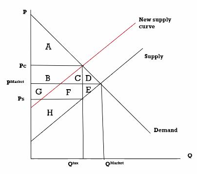

[Home](../../../index.md) > [Public Policy](./index.md) > Taxes

# Bonus Class: Tax Policy

Transportation is a major source of greenhouse gasses - this is a market externality. To counter this, the gasoline tax incentivizes less driving and more electric vehicles.

Fuel Economy standards are a regulation that provide a minimum bar, but do not incentivize vehicle manufacturers to over-achieve like the gas tax does.

# Classifying Policies with *Policy Typology*

Instruments are pretty straight-forward:

- tax, regulation, etc.

But typology is a different method of categorization.

## Theodore Lowi's typology

- Distributive
	- Take from a broad group
	- Give to a narrow group
	- eg. Farm subsidies
	- eg. research grants
- Redistributive
	- Take from an *identifiable* group
	- Give to *different*, *identifiable* group.
	- Can get pretty controversial
	- eg. Social Security
- Competitive Regulatory
	- Lots of deliverers?
	- Limit to a few deliverers
	- eg. allocating the RF spectrum
	- eg. Hunting licenses
- Protective Regulatory
	- Protect against market... stuff
	- eg. unemployment
	- eg. ???

## James Q. Wilson's typology

Both the *costs* and *benefits* of a policy could be *concentrated* among a specific group, or *dispersed* among everyone.

### Costs &rarr; Benefits

*Name of policy type*

Maybe some more information here.

### Conc. -> Conc.

*Interest group politics*

In which both groups are identifiable.

### Conc. -> Dispersed

*Entrepreneurial Politics*

From some, to many.

Convincing policy makers to take action for the public good, against the wishes of a small group.

### Dispersed -> Conc.

*Client Politics*

> Let's subsidize the corn farmers.

### Dispersed -> Dispersed

*Majoritarian Politics*

Everyone pays for the military, which benefits everyone.

## Practice: Classifying Policies

### Superfund

A tax on polluting industries, goes to a fund. Used to clean superfund sites.

Since the cost-bearing group is clearly identifiable, and the benefiting group is identifiable, this could be said to be:

- Conc. -> Conc.
- Redistributive

Since it protects the public from market problems, (pollution is an externality), it could also be a "Protective Regulatory" policy.

### Cigarettes for CHIP

- Tax on cigarettes
- Funds children's health insurance
	- CHIP
	- For families who are too rich for medicade, but too poor to afford health insurance for their children.

Since the cost-bearing and benefiting groups are clearly identifiable, this is:

- Conc. -> Conc.
- Redistributive

# Taxation Policy

- Gov. needs to raise revenue to fund public policies and programs
- Gov. uses taxes to influence behavior
	- "Tax bad, subsidize good"
- There are lots of taxes
	- Gasoline
	- Cigarettes
	- Income
	- root beer!?
	- Property
- Lots of levels of government impose taxes
	- Federal
		- Income
		- Payroll
	- State
		- Sales (45 states)
		- Income
	- Local
		- Property
		- Sales
		- Income

## Taxes and Efficiency

On a supply-demand curve, there is the Equilibrium Price and Equilibrium Quantity.

When taxes are added, there is a difference between what consumers pay and what producers get.

Taxes shift one curve by the amount of the tax. It could shift either supply or demand, both give the same results.

Here's a diagram:

Wait, here's a better diagram:

- Before Tax
	- Consumer Surplus: ABCD
	- Producer Surplus: GFEH
- After Tax
	- Consumer Surplus: A
	- Producer Surplus: H
	- Tax Revenue: BCGF
	- Dead-weight Loss: DE

In a perfectly competitive market, taxes cause dead weight loss.

Meanwhile, if there are market failures (negative externality), a tax can compensate for those.
