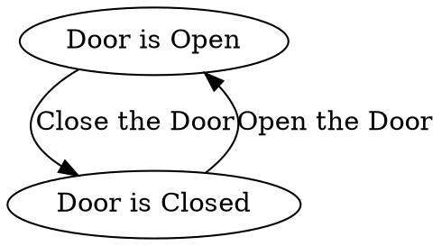
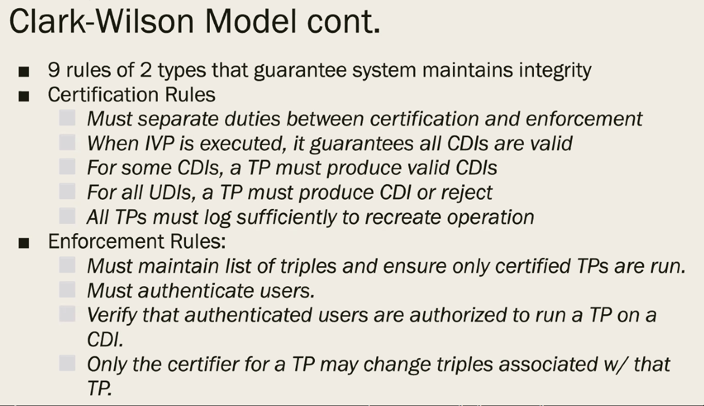
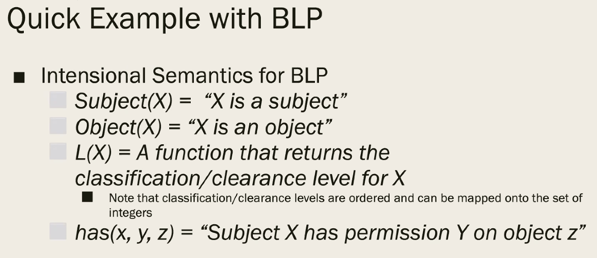
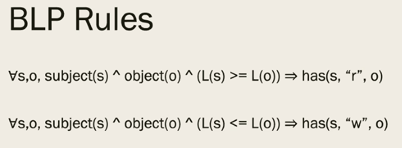

[Index](../../../index.md) > [Authentication](./index.md) > {{ page.date }}: {{ page.title }}

# {{ page.date }}: {{ page.title }}

> Surprise! Things were due. MyCourses didn't tell you because Prof. didn't put them in.
>
> Module One discussion post was due last Friday. Replies are due this Friday.
>
> Thanks, Prof.

The key concept here is *Evaluation Assurance Levels* (EAL). There are 7 levels:

1. Functional Testing
2. Structural Testing
3. Methodically Tested
4. Methodically Designed and Tested
5. Semi-formally Designed and Tested
6. Semi-formally Verified Design, Tested
7. Formally Verified Design, Tested

Most commercial operating systems are around EAL4.

## Security Modeling

A model is a "symbolic representation of a policy". Formal models are *provable*, while informal models are more like guidelines.

> "Symbolic representation of a policy" - what does that mean? I think I know what a policy is, but Prof. might think of it in another way.

We can model all kinds of things, not just security things. We see what states things can be in, and what makes them flow between the states. We draw this on paper as a *Finite State Machine*.

We can draw an *Information Flow Model* to show how data can move between components. If two components can communicate that shouldn't, then we know there's an issue.

Security modeling helps us understand what we're trying to achieve, and prove that we've achieved it.

### Bell-LaPadula

- Focuses on Confidentiality
- O is an object
- S is a subject
- L(O) or L(S) returns the security level of the thing
	- This is different from the EAL

Two Rules:

- Simple Security Condition
	- S can read O if L(S)>=L(O)
	- S has to be at O's level or higher
	- You can't read classified documents
- *-Property (Star Property)
	- S can write O if L(S) <= L(O)
	- S has to be at O's level or *lower* to write it.
	- Classified people can't write unclassified documents.

> But... root can write anything? How does this relate to the real world?

- BLP is very simple
- BLP can be used to prove things about systems
- BLP inspired other models, which are more complex.

### Biba's Model

- Focuses on Integrity
- Is complementary to BLP

If you trust $O_1$, but not $O_2$, and $O_3$ includes both, then you *cannot* trust $O_3$.

- Write access rule
	- S can write O if and only if I(O) <= I(S)
- Biba's Model
	- S can read O if and only if I(S) <= I(O)

In english, the integrity of a new object is less than or equal to it's writer. The integrity of a reader is less than or equal to the objects that it reads.

> Why isn't Biba's model called the read access rule?

### Clark-Wilson Model

Models system behavior as subjects performing transactions on objects. Subjects can't see the objects, but they can see the "transactions", which do have access.

There are two types of data items:

- Constrained Data Items
	- Have been verified by an "IVP"
- Unconstrained Data Items

9 rules of 2 types:

- Certification Rules
- Enforcement Rules

> I'm not typing all that.

### Graham-Denning Model

It has 8 rules.

> That's really all we get to know. Looks like I'm gonna watch a lot of youtube later to actually learn this.

### Harrison-Ruzzo-Ullman Model

> "Some pieces of chocolate have almonds in them" - Prof.

- It extends Graham-Denning
- That's it. That's all you get to know. Cool.

## Multiple Levels of Security (MLS) and Multilateral Security

Governments use a level system:

- Objects receive classifications
- Subjects receive certifications to read objects of equal or lesser rank

*Reference Monitors* (remember reference monitors?) make sure that a subject's cert matches the object's class.

There's also typically a *Need to Know* system, wherein objects are classified into compartments. Only subjects with the certification level *and* are in the same compartment can read those objects.

*Need to Know*, aka *Compartmentalization*, can live side-by-side with MLS.

## Chinese Wall Policy

This one prevents conflicts of interest.

If S reads any O from a compartment, then S can no longer read or write any O in a different compartment. Different compartments are "walled off" from each other.

## Formal Modeling

- Models based in mathematics
- Are provable

Top rule is BLP, bottom rule is STAR

For all subjects, objects, and levels (where level of S is greater than or equal to level of O), then the subject has read access to the object.

## BLP Example

If Alice has a secret clearance, and there is a secret report, then alice can read the report, since her clearance is at or above the level of the report.

> Why wasn't this right after the slides on Biba's model?

---

[Index](../../../index.md) > [Authentication](./index.md) > {{ page.date }}: {{ page.title }}
