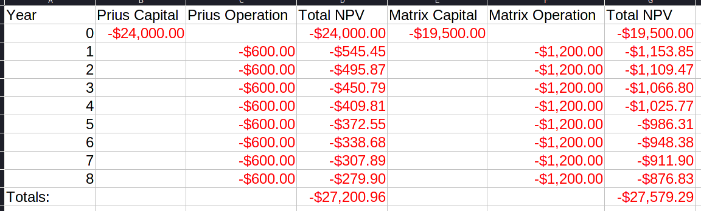

[Index](../../../index.md) > [Decisions](./index.md) > {{ page.date }}: {{ page.title }}

# {{ page.date }}: {{ page.title }}

When doing analysis, multiple perspectives must be considered - the *stakeholders*. Raising electricity costs hurts consumers, but benefits the electric company.

The "society" perspective includes true costs and benefits, and excludes anything that could be classified as a wealth transfer. Taking from one group and giving to another may have impacts, but doesn't increase or decrease the value in the system.

Converting dollars to other things can have a benefit or cost - if a bridge costs 1 million, but the expected value is 10 million, then the bridge increases the value of the system.

An idea can be good from one perspective, but bad from another. The goal is often clear, but determining how to achieve it can be tough. If something is a good idea, then the "winners" should be able to help offset the costs to the "losers".

## The Bounding Problem

How do we draw the line on what benefits and costs to include?

Example: Benefits / Costs of a life-saving treatment. Do we include:

- Future Earnings?
	- Future costs?
- Children?
	- Children's Future Earnings?
- "Revenue Recycling"?

# Discounting and Net Present Value (NPV)

$1000 in one year is equal to $X in two years - but how much is X? X has to be more than 1k to be worth it, but probably doesn't have to be 10k.

Example:

- You have 10k
- You could buy art, and sell it for 11k in one year
- You have a savings account that makes 4% interest

There are multiple analysis strategies:

- Future Value
	- Buying the painting has a future value of 1k
	- Saving has a future value of \$400
	- The painting is more profitable - Buy the painting!
- Present Value
	- Getting 11k through the painting requires 10k right now
	- Getting 11k through savings requires 10576 right now
	- The painting is cheaper - Buy the painting!
- Net Present Value
	- We need to define some kind of discount rate, $d=0.04$
	- Painting:
		- worth -10k today
		- worth +11k in one year
			- worth $11000/(1+d)=10577$ today
		- Now that everything is in "Present Value", we can find the net present value
		- NPV of this option = \$577; it's a good choice
	- Savings Account:
		- Present value of this option: -10k
		- Future value of this option: 10400
			- Present value of future value: $10400/(1+d)=10000$
		- Net Present Value: \$0
		- This option is neutral.
	- The painting option is better - Buy the painting!

Let's define some terms:

- Future Value: $FV$
- Present Value: $PV$
- Net Present Value: $NPV$
- Discount Rate: $d$
- Number of years: $n$

Converting a present value into a future value:

$$
FV=PV*(1+d)^n
$$

Converting a future value into a present value:

$$
PV=\frac{FV}{(1+d)^n}
$$

## Minimum Attractive Rate of Return

Entities usually only look at investments with expected returns above a certain threshold.

Companies look for 10 to 20%, the government looks for 5%, and private citizens can go anywhere from 0 to over 100%.

## NPV Steps

- Find all the costs and benefits, and the years they occur
- Make a *Cash-Flow Diagram*
- Make a second *Cash-Flow Diagram* with discounting applied
- Add things together!

## Example

A friend is thinking of buying either:

- A Prius
	- \$24k
	- 50 mpg
- A Toyota Matrix
	- \$19.5k
	- 25mpg

Our friend drives ~12k miles per year, and will keep the car for 100k miles.

Let's use a discount rate of 10%.

Here's our comparison:

> I used excel because markdown can't do formulas lol

The prius will cost \$27,200.96 over its lifetime, measured in present dollars. The matrix will cost \$27,579.29, which is about \$380 more in present dollars, over its lifetime.

Despite the Prius's higher startup costs, it is worth it over the live of the vehicle.

> Note that this doesn't include the cost of insuring a more expensive car - the higher startup cost gives the prius a higher risk level even if probabilities are the same.

## Cash Flow Diagram

A cash flow diagram has an arrow pointing from left to right, from zero years to the lifetime of the thing being measured. From this central arrow, other arrows (one for each year) point up or down with a cash value. The length of the vertical arrows corresponds to their value.

> This will probably be tough in graphviz. I'll see if I can setup a template in tikz.

---

[Index](../../../index.md) > [Decisions](./index.md) > {{ page.date }}: {{ page.title }}
