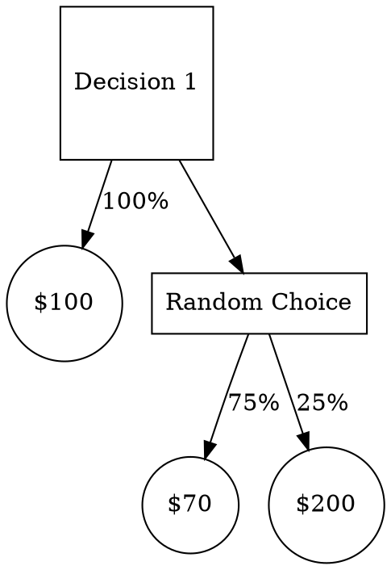
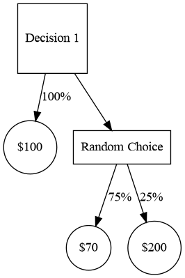
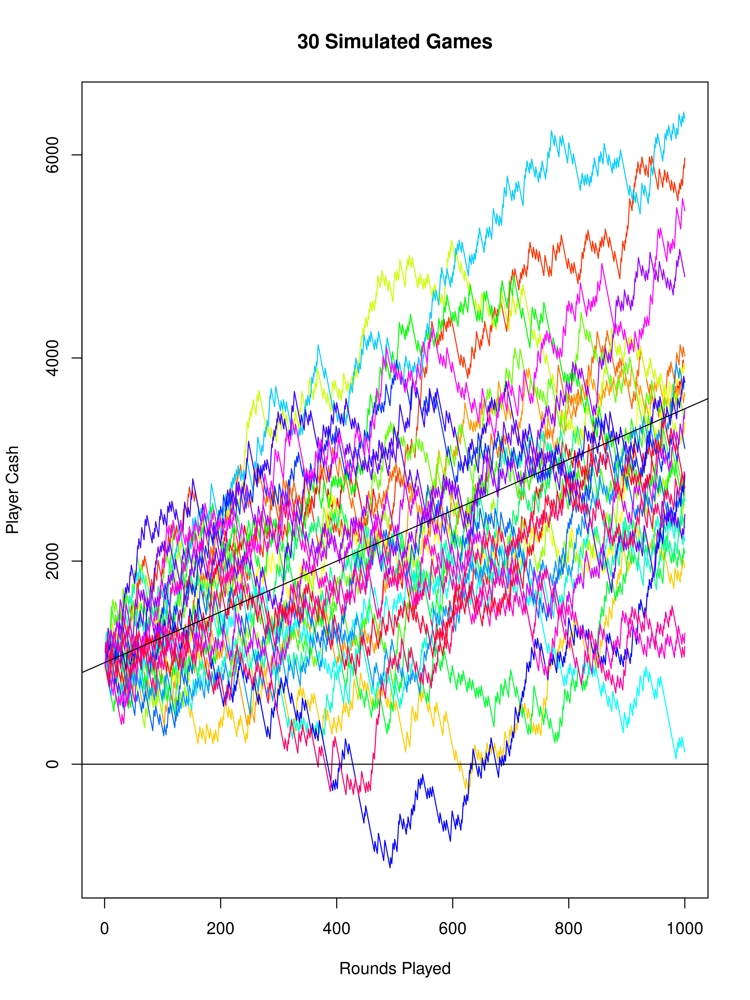

[Index](../../../index.md) > [Course](./index.md) > {{ page.date }}: {{ page.title }}

# {{ page.date }}: {{ page.title }}

There are two things left in the class.

- Assignment 6
    - Consists of two case studies
        - Predict the values of Monroe county houses
        - Did the Prof save money with a wood burning stove?
    - Goes pretty in-depth
- Test 2
    - Non-cumulative

# Decision Trees

> Not in assignment 6, but on the test

You have a choice between:

- Receiving $100
- 3 to 1 odds of getting $70 or $200





Outputs are worth some value. Solve the tree from right to left. (Bottom to Top in my graph). When you reach a chance node, calculate its expected value. When you reach a decision node, give it the value of the highest downstream chance node.

# Me, Messing around

You have a choice between:

- Receiving $100
- 3 to 1 odds of getting \$70 or \$200

Using arithmetic mean, the second choice is worth \$102. Using the geometric mean, it's worth \$91.

What if we simulate this? It costs $100 to play, and we get some amount back.

```js
function simulate(){
    let bank = 0;
    let iterations = 1000000;
    for(let i=0; i<iterations; i++){
        bank -= 100;
        bank += Math.ceil(Math.random()*4) === 4 ? 200 : 70;
    }
    // return avg gain per play
    return bank/iterations;
}
```

I ran this a few times. Results ranged from 2.4 to 2.5, implying the gamble is worth $102.5, and the arithmetic mean is correct.

Let's change up the code...

```js
function simulate(){
    let bank = 1000; // start with 1k
    let iterations = 1000000; // 1m rounds
    for(let i=0; i<iterations; i++){
        if(bank < 100){
            return (bank - 1000)/i;
        }
        bank -= 100;
        bank += Math.ceil(Math.random()*4) === 4 ? 200 : 70;
    }
    return (bank-1000)/iterations;
}
```

Most of the time, the game ends with an average return of $2.40 per turn. However, sometimes the player goes bankrupt before completing all million rounds. Let's run the simulation 1000 times, and record the results:

```js
function metaSim(){
    let wins = 0;
    for(let i=0; i<1000; i++){
        wins += simulate() > 0 ? 1 : 0;
    }
    console.log(`${wins} out of 1000 games survived. Win rate is ${Math.round(wins/10)}%`);
}
```

Each call to `metaSim()` simulates one *billion* rounds of the game. This takes about a minute. Running this multiple times took a while.

```
811 out of 1000 games survived. Win rate is 81%
774 out of 1000 games survived. Win rate is 77%
781 out of 1000 games survived. Win rate is 78%
```

Let's say there is an 80% chance of 2.4% returns, and a 20% chance of -100% returns. Over many iterations, this means we expect -18% returns. You shouldn't play this game. I wonder if I can simulate this, too.

I'll simulate a shop that runs this game (starts with 1m) and sees multiple customers (each with 1k). Most customers will walk away with 2.5% returns - but the ones that go bankrupt can't play the game anymore, so the shop will keep all of their money.

```js
function shopSim(){
    // The shop starts with 1mil
    let shopBalance = 1000000;
    // 1k customers will start with 1k each
    for(let cNum=0; cNum<1000; cNum++){
        let customerBalance = 1000;
        for(let round=0; round<1000; round++){
            // Can the customer afford to play?
            if(customerBalance<100) break;
            // Can the store afford to play?
            if(shopBalance<200) break;
            // Play!
            let result = Math.random()*4 > 3 ? 200 : 70;
            customerBalance += result-100;
            shopBalance -= result-100;
        }
    }
    console.log(shopBalance);
}
```

If I'm right (you shouldn't play this game) then the shop will end with more money than it started with.

Results:

```
190
190
190
100
170
170
180
100
160
```

No! The shop is going bankrupt! The customers are making a profit! *What if I give the shop more money?*

Starting the shop with 1 billion dollars:

```
997883940
997918710
997892580
997984120
997787270
997852830
997804050
```

All of these are less than 1 billion. The shop is losing money (roughly 3mil), but no longer going bankrupt (that's hard to do when you start with 1b).

Here's another idea - playing the game for more rounds, while it *does* let the customers make more money, also gives them more opportunities to go bankrupt. Let's run the sim again, with 1mil rounds per customer instead of 1k:

(Once again, at 1b rounds, this takes a while):

```
100
150
180
```

The shop is going bankrupt again. It's losing all *billion* dollars. This is a disaster!

I really need to dig-in and understand what's going on. It's time to break out the R code.

```r
# How many rounds will the game last?
iterations <- 1000
# How much cash will players start with?
startingBalance <- 1000
# How many players will we simulate?
linesCount <- 30
# Function to simulate one player
doSim <- function(){
    results <- vector("numeric", iterations)
    balance <- startingBalance
    for(i in 1:iterations){
        random <- runif(1, min=0, max=4)
        if(random > 3){
            balance <- balance + 100
        }else{
            balance <- balance - 30
        }
        results[i] <- balance
    }
    results
}
# Run the function a bunch of times
lines <- list(linesCount)
for(l in 1:linesCount){
    lines[[l]] <- doSim()
}
# Find the range of the lines, for the graph
myRange <- range(lines[[1]])
for(l in 2:linesCount){
    myRange <- range(myRange, lines[[l]])
}
colors <- rainbow(linesCount) # colors are cool
# Plot the first line
plot(
    1:iterations,
    lines[[1]],
    ylim=myRange,
    type="l",
    col=colors[1],
    main="30 Simulated Games",
    ylab="Player Cash",
    xlab="Rounds Played"
)
# Plot the other lines
for(l in 2:linesCount){
    lines(1:iterations, lines[[l]], col=colors[l])
}
# Add some reference lines
abline(c(0,iterations),c(0,0))
abline(c(0,iterations),c(startingBalance,startingBalance*1.025))
```



Now that's some unicorn vomit. This graph teaches us some important lessons (Or at least makes more obvious things we should already know):

- Everyone starts at the same point
- From there, things *very quickly* spread out
- Games that go up a lot, go up a lot
- Games that go down, don't actually go down that much
- In general, players make money over time
- The starting balance for a player is *very* relevant to weather or not they go bankrupt.

So what went wrong with the previous simulations? Those simulations let players play a *lot* of rounds, and we expect players to make roughly $2.50 per round. By the law of large numbers, this general increase gets more accurate with time.

So - if we're the shop, we want to *stop* players from playing a lot of rounds. How can we do that?

- If the players start with less money, they are more likely to go bankrupt
- If the players get kicked out when they make too much, we can avoid "un-bounded" losses.

// TODO - JS that finds what percentage of players take *any* loss within the first 5 rounds.

---

[Index](../../../index.md) > [Course](./index.md) > {{ page.date }}: {{ page.title }}
