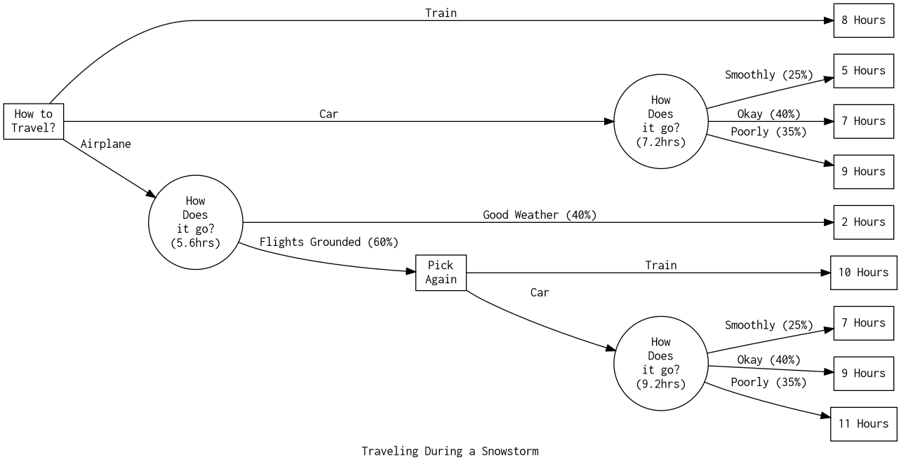
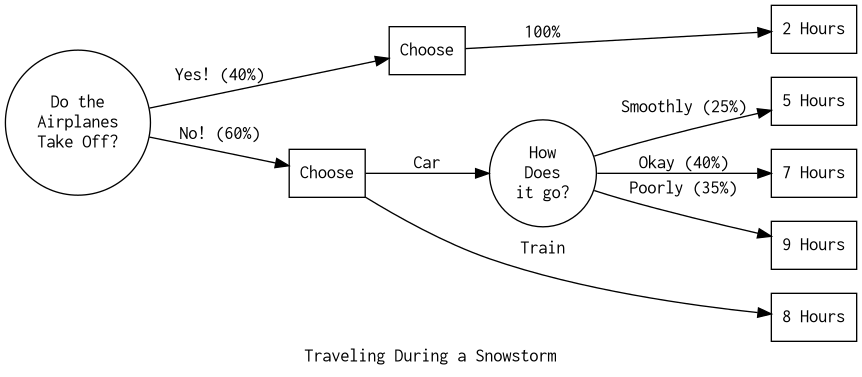

[Index](../../../index.md) > [Course](./index.md) > {{ page.date }}: {{ page.title }}

# {{ page.date }}: {{ page.title }}

Decision Trees! Not on assignment 6. (Assignment 6, by the way, is a big one. Start soon!) Meanwhile, decisions trees will definitely be on the test.

## The snowstorm example

You're traveling home for winter break, and have three options:

- Train, which takes 8 hours
- Car, which could take 5, 7, or 9 hours depending on how it goes
- Airplane, which takes 2 hours, unless the flights are grounded due to snow
    - If the flights are grounded, you have to pick another option.

The car has a 25% chance of going smoothly, and a 40% chance of going okay. The flights have a 60% chance of being grounded.

We see that the best **Strategy** is to head to the airport. If the flights are grounded, the car is the backup.

## Risk Profiles

A **Strategy** is your plan at the start of a decision tree - it's a roadmap from the start to the end. In the snowstorm example, our strategy is to head to the airport, and if the flights are grounded, take a car.

> Strategy: *"Choose X, and then if Y happens, choose Z."*

For each strategy, you can find the probability of each possible outcome. This graph, of outcomes on the X axis and probability on the Y, is a *risk profile*.

## Value of Information

Our decision trees are based on our best guesses of the probabilities. We can find out how much information is worth to us by looking at the decision trees.

Normally, we decide which path to take, and then chance nodes resolve. To find the **Expected Value of Perfect Information**, put your chance node first - then make your decisions knowing the output. If this model gives you a higher expected value, then the information is valuable - and you know exactly how valuable.

TODO - add some example diagrams here.

---

[Index](../../../index.md) > [Course](./index.md) > {{ page.date }}: {{ page.title }}
