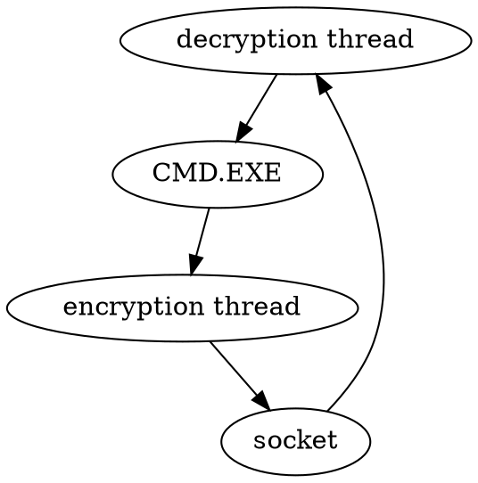

[Index](../../../index.md) > [Malware](./index.md) > 2021-01-26: Terminology

# 2021-01-26: Terminology

C and C++ are the top two languages for malware development, for three reasons:

1. No Dependencies - No runtimes or interpreters.
2. High level of control - directly call (and abuse) OS APIs.
3. Tiny file size - faster loading, easier to hide

**Downloaders** download other malware and run it. They infiltrate target territory and then bring in their friends. In the windows API, `URLDownloadtoFileA` is often chained with `WinExec` - download and execute.

A **Launcher** or **Loader** is an executable that installs malware for immediate or future use. The loader is packaged with the malware it installs. Launchers commonly inject the malware into already running processes to take over their memory and privileges.

> If a downloader also launches malware, can it use the same techniques? Is the only effective difference the inclusion/downloading of the payload?

A **Backdoor** is an attacker-installed way of accessing a system, other than their initial method.

A **Rootkit** is a method of maintaining root-level access to a machine.

A **Reverse Shell** is a connection from the target system back to the attacker. Target systems are typically behind some method of blocking incoming connections, so the attacker can't connect directly. However, the target can start outgoing connections to an attacker server.

Malware likes to open a *socket* to the attacker, then bind the IO streams to a new `CMD.EXE` process with the window suppressed.

There are three *default* **File Descriptors**:

0. STDIN - the process's input stream
	- In a default terminal, this is bound to the keyboard.
1. STDOUT - the process's output stream
	- Default is the terminal screen
2. STDERR - for error messages
	- Default is also the terminal screen

There is a fun thing called a **Multi-Threaded Reverse Shell**. Data from the socket flows through thead1, then stdin of the processes, stdout of the process, then thread2, then back to the socket. The threads perform decryption / encryption to disguise the traffic over the wire.

A **Trojan** is an evil program that pretends to be nice. This helps it blend in and avoid detection.

A **RAT** could be a remote administration tool - but it could also be a *remote access trojan*. This is a special trojan that allows, well, remote access.

A **Botnet** is a collection of many infected machines that can all be controlled at once.

In **Dynamic Linking**, the libraries and functions the binary uses are loaded with the binary, but aren't included *inside* the binary.

In **Runtime Linking**, the binary calls out to the libraries it needs when it needs them. The binary still needs at least two functions to do this:

- `LoadLibrary`
- `GetProcAddress`

> Wow, I need to go learn some x86

---

[Index](../../../index.md) > [Malware](./index.md) > 2021-01-26: Terminology
