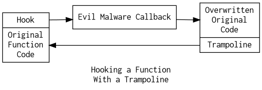

[Index](../../../index.md) > [Malware](./index.md) > 2021-02-04: Trampolines and Installing Hooks

# Trampolines and Installing Hooks

## Quick review of trampolines

- The beginning of a benign function is overwritten, to pass control to a "callback"
- The callback does evil things, before jumping to the trampoline
- The trampoline has the overwritten original code to setup the normal function
- The trampoline bounces back up to the rest of the original function



## Installing the function hook

`LoadLibraryA` takes a *string* (as the name of a library to load) off the stack, and returns the address of the loaded library in **eax**.

`GetProcAddress` takes the address of a library off the stack, then a *string* function name, and returns the function's address in **eax**.

`memcpy` takes three arguments, in order:

- Destination address (top of stack, last pushed)
- Source address (or is this first???)
- Number of bytes to copy

It copies *number* bytes from *source* to *destination*.

Using these three functions, malware can create a "jump here" snippet, and install it over the start of a legitimate function.

> In class, the malware snippet used `LoadLibraryA` and `GetProcAddress` to get the address of a windows API function that returned valuable information. Netstat uses said function to tell which process is listening on which port. Naturally, the malware wants to hide this.
>
> The malware started with a snippet like this:
>
> ```
> mov eax, 0
> jmp eax
> ```
>
> Then, the malware used `memcpy` to overwrite the zero in the snippet with the address of its new, malicious function.
>
> Finally, the malware used `memcpy` to copy the entire snippet over top of the start of the target windows API function. As a result, netstat can no longer get the information it asks for.

> Lab 1 is activities 11-2 and 11-3 from Practical Malware Analysis, due February 11th at 11:30pm.

---

[Index](../../../index.md) > [Malware](./index.md) > 2021-02-04: Trampolines and Installing Hooks
