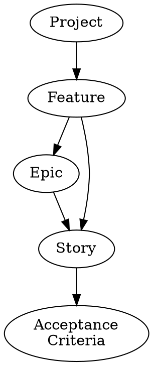

[Index](../../../index.md) > [Software Engineering](./index.md) > {{ page.date }}: {{ page.title }}

# {page.date}: {page.title}

## Gathering Project Requirements

Two types:

- functional
    - The behaviours of the application
- non-functional
    - Systemic qualities, like response time or reliability
    - Things like Security, or extendability
    - "Inherent Attributes"

There is a functional requirement hierarchy:

If a feature is made up of more than one story, then the collection of stories is called an "Epic".

### Example:

> The "Director" manages a soccer league three seasons a year. Players need to register. The director selects a group of captains to form teams. The director moderates the drafting of teams by captains. The Director must also schedule the games of the league across the whole seasons up to 15 weeks. The Director must also be able to record game results and keep track of team rankings.

- Users register
- The Director can create Teams
- The Director can set players as captains of teams
- Team captains can "request" a player
- The director can approve requests
- The director adds games to a calendar
- Games have state: upcoming, canceled, won, lost, etc.
- The director can change game state

### Stories

In Agile, requirements are written as user stories.

> As a \<ROLE>, I want to \<GOAL> so that \<BENEFIT>.

We'll be using Trello to record and manage stories.

> Teams will create a trello group, then Prof. will supply us with some defaults.

The story is a little vague, which is why we get...

### Acceptance Criteria

A detailed statements about how the system should behave.

**GIVEN {some condition} WHEN {some action occurs} THEN {system does some} thing**

> Given that I am not signed in, when viewing the home page, then I should see a sign-in button.  
> Given that I am not an administrator, when hitting back-end APIs, then I should be denied access.

When a story gets too big, it should be broken into smaller stories to become an epic - a group of stories. A story must be achievable within 1 sprint (week).

### Spikes

> "A story or task aimed at answering a question or gathering information, rather than at producing shippable product"

Use spikes for learning new technologies or new techniques. If using for code, it's proof-of-concept / throw-away code.

### Minimum Viable Product

The absolute slimmest set of requirements standing between you and "functional".

## OOP Review

A *Class* is a template for a run-time *Object*. UML notation helps us model our objects/classes.

Objects have *state*, and *functions* to transform that state.

> When objects interact, the state may not be on the object you think. A checker piece has no concept of position, it doesn't care where it is - but the board certainly cares. The board maintains a mapping of positions to pieces.

If objects have similar state (and maybe state mutators), then this *common functionality* should be *abstracted*, into an *interface* or an *abstract class*.

**Interfaces** contain function *signatures* - they force inheritors to implement those functions.

**Abstract Classes** cannot be instantiated, but they can define functionality. You cannot have a shape, but you can have a rectangle.

---

[Index](../../../index.md) > [Software Engineering](./index.md) > {{ page.date }}: {{ page.title }}
