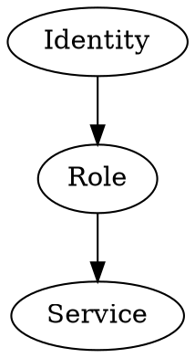

> Todo - this navbar should be moved to a template

[Home](../../../index.md) > [GCP](../index.md) > [Professional Security Engineer](./index.md) > Preparing for Your Professional Cloud Security Engineer Journey

The exam covers 5 *Domains* (also called *Sections*). Each Section includes multiple *Objectives*.

The Sections and their Objectives are available in a tree-structure in the [*Exam Guide*](./guide.md).

This course will be broken down into *Modules*.

Modules 1 through 5 map to the 5 domains of the exam.

0. Introduction
1. Configuring access within a cloud solution environment
2. Configuring network security
3. Ensuring data protection
4. Managing operations in a cloud solution environment
5. Ensuring compliance
6. Next steps

# Module 00: Introduction

## Introduction to the role

*What is the role of a Professional Cloud Security Engineer (PCSE)?*

1. Enables organizations to design and implement secure workloads and infrastructure
2. Designs, Develops, and Manages a secure infrastructure by leveraging google cloud security technologies

A PCSE has proficiencies in:

- Identity and access management
	- > Control access to stuff
- Defining organization structure and policies
	- > Write the rules that control access to stuff
- Using GCP tech to provide data protection
	- > Control access to stuff (data)
- Configuring network security defenses
	- > Configure network stuff to control access to stuff (network-based stuff)
- Collecting and analyzing GCP Logs
	- > Read stuff to see who accessed stuff
- Managing incident responses
	- > oh no someone accessed our stuff
- Applying dynamic regulatory considerations
	- "Changing stuff to fit new legal requirements"
	- > The government says to control access to stuff

In this course, we will imagine ourselves as an employee of "**Cymbal Bank**".

Cymbal wants secure operations within a hybrid cloud environment. We will:

- Work w/ cloud architects and network engineers to design the cloud env
	- > Work w/ people to make a plan
- Use security practices that are in compliance with industry regulations
	- > Follow the law
- Configure IAM and help define organizational structure and policies
	- > Configure the access to the stuff
- Ensure that Cymbal bank makes use of GCP tech
	- > Use the right tool for each job

Exam questions will be scenarios involving Cymbal bank, wherein we must select the *best* answer.

## Cert Value and Benefits

Why become certified?

- Industry recognition
- Validates expertise

The associate cert requires technical knowledge. The professional cert *adds on* the ability to evaluate case studies and *design* solutions - make business-aware decisions.

The following modules follow the exam guide. The exam guide is broken into 5 *sections*, each of which has multiple *objectives*. Modules 1 through 5 of this course map to the 5 sections of the exam guide.

Each module corresponding to a *section* will have *diagnostic questions*. These questions will help identify knowledge gaps, to guide your studying.

At each point in a module that corresponds to an *objective*, there will be resources for learning to accomplish that objective.

## Certification Process

Resources for studying:

- Online courses. Recommended include:
	- Fundamentals of GCP (number 2 on the path, after this one)
	- Networking in GCP (3). Two "sub courses":
		- Defining and implementing networks
		- Hybrid connectivity and network management
	- Security and GCP (4). Three "Sub Courses":
		- managing security in GCP
		- security best practices in GCP
		- Mitigating security vulnerabilities in GCP
- practice labs
- practice questions

> The learning path also includes:
> - Ensure Access and Identity in Google Cloud
> - Logging, Monitoring, and Observability in Google Cloud
> - Secure Workloads in Google Kubernetes Engine
>
> It's interesting that these aren't mentioned here.

Skill badges are learning paths made of labs. Do them to get badges. badges=labs and labs=badges.

Sample questions: Diagnostic questions identify knowledge gaps, to show you where to study - sample questions are also good, and simulate the exam.

**Exam questions**:
- Present a scenario
- Explain the goal; what you are trying to achieve
- Ask you what you would do in that situation

Tips:
- Read questions carefully
- Anticipate the correct answer
- More than one answer may be possible
- Take questions at face value
- Pay attention to qualifiers ("usually", "all", "best")

[https://cloud.google.com/docs] is your new best friend.

## Creating your study plan

Diagnostic questions will identify study areas, and resources to reinforce those areas.

Questions will relate to the cymbal bank scenario.

Diagnostic questions don't cover the entire exam.

Sections and Objectives will contain links to additional learning resources.

## Workbook

> The workbook comes in multiple formats. I used the Google Slides version, so I could keep it open and edit in another tab - it's also associated with my google account, so I won't lose it.
>
> It looks like the workbook has all the diagnostic questions in it - I find it helpful to highlight text in each answer and add comments as to why I think that answer is right or wrong.

# Module 01: Configuring Access within a cloud solution environment

## Module Overview

1. Planning Cymbal Bank's cloud identity and access management
2. Diagnostic questions
3. Review and study planning

## Planning Cymbal Bank's Identity and Access Management

CB is extending data center and office to GCP, following a hybrid model.

- Config cloud identity
- Config service accounts
- least-privilege access control & separation of duties

"Google Cloud Directory Sync" (GCDS) will run daily, to sync AD into google cloud identity.

Service accounts provide services access to GCP.

Cymbal bank will use google key management, to reduce chance of key exposure.

Features of Google key management to know:
- "GKE Workload Identity"
- "Workload Identity Federation"

You will automate the rotation of keys, and audit key usage.

Who has access to which service accounts? Can we audit that? GKM can.

The organizational heirarchy will be built with folders.

Organizational policy constraints will control things across the heirarchy:
- Zones
- services
- identities
- domains
- service accounts

"IAM Conditions" can be added to roles, to define where, when, and how the role can be used.

## Diagnostic Questions

The diagnostic questions check that you can:

1. Configure Cloud Identity
2. Manage service accounts
3. Manage authentication
	- Do you know SAML and SSO?
	- Do you know X.509 certs?
4. Manage / Implement authorization controls

## Knowledge Check

- IAM Conditions control where/when identities can access resources
- **Google Cloud Directory Sync** ... syncronizes directories

# Module 02: Configuring Network Security

This is part 2 of the exam: Network security.

- Design Network Security
	- design it
- Network segmentation
	- It's important.
	- WAFs are cool, like GCP CloudArmor.
	- Keep ports away from the public internet
- Establish Private Connectivity
	- VPN type stuff
	- Only authenticated traffic should reach services

## Design

**HTTPS load balancers**:
- protect against layer 3 and 4 attacks (DDOS)

**CloudArmor**:
- Protects against layer 7 DDOS
- SQL Injection
- XSS
- Can filter traffic by rules, for custom sauce
	- Inject Captcha?
	- Filter bots?
	- Rate limit stuff :)

> "Ensure that the majority of traffic flows through the HTTPS Load Balancer and CloudArmor"

## Segment

Employees connect to things through the **Identity-Aware Proxy**. It can be combined with the **Identity Platform** as an IDP, or others.

**Cloud DNS** supports DNSSEC.

> we love dnssec

**Firewall Rules** allow valid/expected traffic, block by default.

*Hierarchical* firewall rules "ensure consistency across projects". Interesting.

**Virtual Private Cloud Networks** will contain things, and can be peered to talk to each other. Everything uses a private IP.

## Private Connectivity

**Cloud VPN** lets on-prem get to cloud via a tunnel.

**Interconnect** - what is this?

**Google Private Access** lets requests to GCP's API from private networks.

**Cloud NAT** lets internal workloads make requests to the public internet. Everything outbound goes through this.

## Diagnostic Questions

- Use *Identity-Aware Proxy* to access stuff
- Understand CloudVPN vs Direct Interconnect vs Partner Interconnect
- NAT is for outbound traffic
- Understand DNS Peering vs Forwarding zones
- Do you know HTTP response codes?
- Connect AppEngine to VPCs via a "connector"
- Where do you put TLS certs - https load balancer? SLL proxy? TCP proxy? hmmm
- Create firewall rules

## Question Review

Rough outline:

- Configure network perimiter controls
	- Firewalls, IAP
- Configure Load Balancing
	- Global, Network, HTTPS, SSL Proxy, TCP Proxy
- DNSSEC
- Private vs Public addressing
- WAF
- Cloud DNS

> I need to learn more about cloud DNS

# Module 03: Ensuring Data Protection

> Secure all the data

- Protect sensitive data
	- encryption
	- access control
- CLASSIFY
- Enforce access and usage
- Prevent Exfiltration

**GC DLP** will scan data for PII:
- Names
- Emails
- Phone numbers
- SSNs

Cloud DLP can transform data. It can work on images and PDFs too!

Store data in CloudStorage **buckets**. We want to do access control at the bucket level if  possible, leaving object-level for edge cases.

BigQuery - protect at the dataset level, with a few exceptions at the table level.

Key-Value data goes in **Secret Manager**.

All data is encrypted at rest. We can add more layers:
- **CMEK** - Customer Managed Encryption Keys

# Module 04: Managing Operations in a Cloud Environment

# Module 05: Ensuring Compliance

# Next Steps
