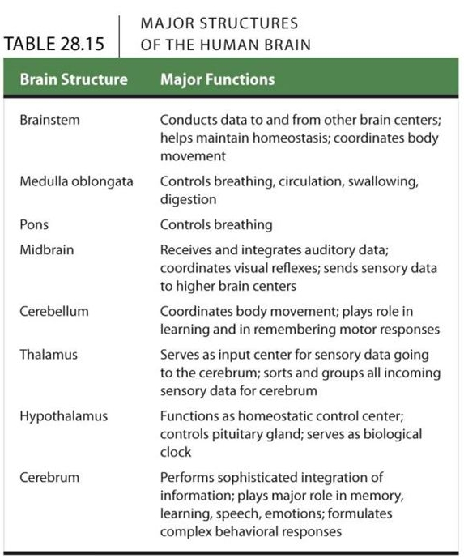

[up](../index.md)

# Bio II, FEB19 - Nervous System

## Housekeeping

- Finishing chapter 28 today
- HW #5 and #6 due FEB24
- Annotated Bib feedback... eventually.
- Final Projects part II due MAR1

## Chapter 28 - The Nervous System

- Nervous system structure and function
- nerve signals and their transmission
- an overview of animal nervous systems
- the human brain

### Nervous System Structure and Function

- Event Coordination
    - Endocrine System
        - Chemical response
        - Slower, more sustained
    - Nervous System
        - Nerves
        - Fast, less sustained response.
- Structure of a Neuron
    - 
    - Cell body picks up signals with *Dendrites*
    - Signal goes onward through the *Axon*, made of *Schwann Cells*
    - Schwann cells are wrapped in layers of *Myelin*
    - At the end of the Axon, are the *Synaptic/Axon Terminals*
    - Signal is then picked up by the next cell
- Three Functions
    - Sensory Input
        - See the object
    - Integration
        - the object is a scary bear
        - the object is tasty cake
    - Output
        - Run away
        - Eat the cake
- The brain doesn't get *everything*
    - Some senses are wired directly to responses, never reach the brain
    - Ex. Tapping the knee triggers a light kick

### Nerve signals and their transmission

Lots of diagrams here

- Nerve function depends on charge differences across neuron membranes
    - Charge differences trigger reactions
    - Always positive, but some areas are more positive. "Negative" here just means less positive than other areas.
- Resting Potential (Neuron at rest)
    - Inside the cell, slightly negative (More `K`, less `Na`)
    - Outside the cell, slightly positive (Less `K`, more `Na`)
- Neuron stimulation (Action Potential)
    - Highly recommend slide review for this
        - Blue channels, `Na`
            - More `Na` on the outside
        - Green channels, `K`
            - More `K` on the inside
    - Depolarization
        - Stimulus opens a few `Na` channels, some `Na` moves in
    - Full speed ahead
        - All `Na` channels open, `Na` flooding in
        - Polarity flips from resting state
            - Inside is now more positive
    - Re-polarization
        - `Na` channels close
        - `K` channels open,    `K+` rushes out
        - Interior once again more negative than exterior
    - Overcompensation
        - `K` channels are not perfect at closing, charge difference overshoots resting potential
        - Checks/Balances restore equilibrium
    - Resting Potential Once again
- Propagation of action potential along the axon
    - Like a domino effect, one part of the axon firing triggers the next part
- Connection to the next neuron (Synapse)
    - Electrical synapses
        - Current jumps directly from terminal to dendrite
    - Chemical synapses
        - Vesicles containing neurotransmitters release their contents
        - Receiving proteins open when contacted by neurotransmitters
        - Open receiving proteins take in `Na`, message passed on
- Neurotransmitters
    - Some excite the receiving cell
    - Some inhibit activity
    - affecting neurotransmission
        - Caffeine, adrenaline enhance neurotransmission
        - Alcohol slows things down
- There are a lot of inputs and outputs, tons of connections

### An overview of animal nervous systems

This is the Evolution part

Most everything uses nerves in the same way, but there is huge variation in the way nervous systems are organized.

- Nerve Net
    - typically in radially symmetric organisms
    - 360 degree response
    - actually looks like a net
- Bilateral
    - Cephalization
        - Concentration of nervous system at the head
    - Centralization
        - A denser, more concentrated area of nerves
        - "Presence of a central nervous system distinct from a peripheral nervous system"
- Vertebrate Nervous System
    - Central Nervous System
        - Brain and Spinal cord
    - Peripheral Nervous System
        - Nerves that go all the way to fingers and toes
- Sequence of Events
    - Stimuli
    - Sensory receptors
    - Central Nervous System
    - Motor Neurons
        - Somatic System (Motor system)
            - control of skeletal muscle
        - Autonomic nervous system (involuntary)
            - Parasympathetic division
                - "Reserve and Conserve"
                - Slow heart rate, enhance digestion, relax
            - Enteric division
                - Control of Digestive system
            - Sympathetic division
                - "Fight or Flight"
                - Preparation for energy expenditure
                - restrict digestion, up heart-rate, pupils open, breathing up

### The Human Brain

- Forebrain
    - Cerebrum
        - Largest, most complex part
        - Left and Right hemispheres
            - Lateralization -> side to side specialization
            - Left side
                - Verbal, Logical, Rational
                - Global information
                - stroke here restricts speech
            - Right side
                - Nonverbal, intuitive, creative
                - specific information processing
        - thick band of fibers, *corpus callosum*, allows inter-hemisphere communication
        - Under corpus callosum, *basal nuclei* are important for motor coordination.
    - Diencephalon (Thalamus, hypothalamus, posterior pituitary, pineal gland)
- Midbrain
    - midbrain (?)
- Hindbrain
    - Pons, Cerebellum
    - Medula-oblongata

- More on the Cortex Lobes
    - Frontal
        - Speech
        - Motor cortex
    - Parietal
        - Somatosensory cortex
        - Taste
        - speech
        - reading
    - Temporal
        - smell
        - hearing
    - Occipital
        - Vision

What we need to know:

# End
